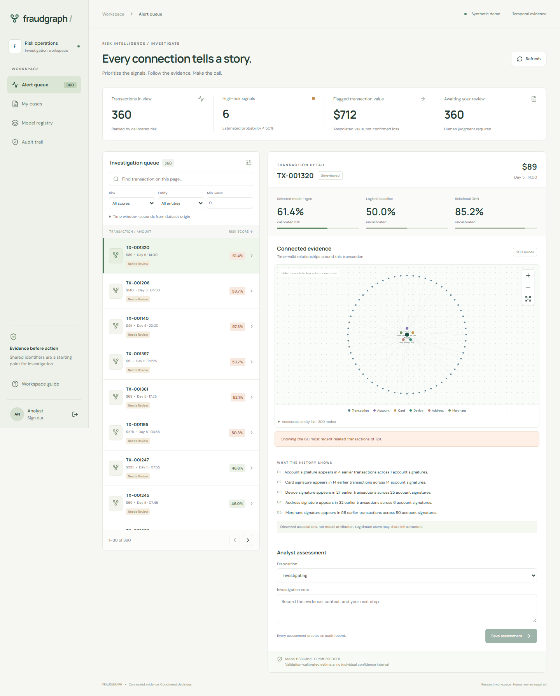

# FraudGraph

**V2 local staging:** research improvement experiments and multi-organization staging are implemented. See [research results](docs/research-v2-results.md), [staging operations](docs/staging-operations.md), and [V2 readiness evidence](docs/readiness-v2.md). Start with `docker compose -f compose.staging.yaml up -d`, then open http://127.0.0.1:13004. See the readiness report for hosted deployment requirements.

A temporal graph fraud investigation workbench. Rank transactions, inspect shared infrastructure, compare model scores, and record an analyst assessment with an auditable case export.

**Benchmarks:** a reproducible synthetic demo, a [10,000-transaction IEEE-CIS cohort benchmark](docs/ieee-results.md), and [full-data tabular](docs/ieee-full-tabular.md) and [GNN comparisons](docs/scaled-gnn-results.md) covering all 590,540 labeled rows. The [local release audit](docs/release-audit.md) passed. The full-data GNN test window was previously inspected for tabular results; this is not a newly blind evaluation.



## Run locally

Requirements: Python 3.12 through [uv](https://docs.astral.sh/uv/), Node.js 24 or newer, and about 1 GB for dependencies. Commands below run from the repository root unless noted.

```powershell
uv sync --frozen --python 3.12
Copy-Item .env.example .env
uv run python -m ml.pipeline demo --out artifacts/release --epochs 100
cd apps/web
npm ci
cd ../..
```

If `artifacts/release/manifest.json` already exists, the local demo has already been trained. Do not rerun into its frozen directory. Use a different `--out` for a new experiment and update `FRAUDGRAPH_ARTIFACT_DIR` accordingly.

Run each command in a separate terminal:

```powershell
uv run uvicorn services.api.main:app --host 127.0.0.1 --port 8000
```

```powershell
uv run python -m services.inference.worker
```

```powershell
cd apps/web
npm run dev
```

Open [the workspace](http://127.0.0.1:3000). The local-only analyst token is `local-demo-token-change-me`. Tokens are held in browser session storage and forwarded through the same-origin Next.js proxy. The API reference is at [localhost:8000/docs](http://127.0.0.1:8000/docs).

On Windows, `./scripts/dev.ps1` installs the dependencies, trains a missing demo, and prints the terminal commands.

## Features

- Canonical event validation, deterministic simulation, IEEE-CIS importer, source checksums and dataset audits.
- Strict chronological 60/20/20 splits; separate model-selection and calibration windows inside validation.
- Amount rule, weighted logistic regression, XGBoost, XGBoost with historical graph statistics, GraphSAGE, and a heterogeneous R-GCN with per-cutoff entity snapshots.
- Three-seed comparisons, AP/PR-AUC, precision and recall at the alert budget, recall at 1% FPR, fraud value captured, calibration diagnostics, unseen-entity slices, relation sensitivity, graph-quality and drift reports.
- A frozen model bundle, local experiment registry, optional MLflow tracking, and a dedicated once-only final-evaluation command.
- FastAPI alert ranking, evidence retrieval, entity associations, owner-scoped cases, JSON exports, audit history, and a SQL-backed idempotent batch queue.
- Next.js dashboard with filters, comparison scores, interactive Cytoscape evidence, accessible entity controls, notes, cases, registry and audit views.
- SQLite for a zero-service local setup; SQLAlchemy/PostgreSQL configuration and Docker Compose for a multi-service setup.

## Verify

```powershell
uv run ruff check .
uv run ruff format --check .
uv run pytest -q
uv run python -m scripts.export_openapi
cd apps/web
npm run typecheck
npm run generate:api
npm run build
npx playwright install chromium
# With API and web running, against a synthetic 1,800-event demo:
npm run test:e2e
```

Browser tests record videos and screenshots and exercise five analyst journeys. They create explicitly labeled demo notes in the local database. Use an isolated test database when preserving your own case history matters.

## Public-data experiment

Follow [dataset acquisition](docs/dataset-decision.md). After accepting the Kaggle rules and downloading the **labeled training** files:

```powershell
uv run python -m ml.pipeline import-ieee --input data/ieee/train_transaction.csv --identity data/ieee/train_identity.csv --out data/ieee
uv run python -m scripts.train_ieee_cohort
uv run python -m ml.pipeline final-evaluate --out artifacts/ieee-cohort-10000
```

These commands create the documented 10,000-row chronological cohort using the reference graph implementation. They are for a fresh experiment: do not overwrite an existing frozen cohort or reopen its final evaluation. The separate [full-dataset scaling procedure](docs/scaling.md) uses disk-backed caches and exact batched graph computation for all 590,540 rows. Do not randomly subsample the headline experiment or repeatedly inspect its final holdout.

Final evaluation checks the frozen code, dataset and model checksums, then refuses to run again in that experiment directory. This is a workflow guard, not a security boundary against an operator intentionally copying artifacts.

## Tracking and deployment

```powershell
uv run --extra tracking python -m scripts.track_experiment --artifacts artifacts/release
```

This mirrors every recorded seed/model run into a local MLflow SQLite store. Frozen JSON records remain the portable source of truth. See [operations](docs/operations.md) for batch submission, isolation, rollback, monitoring and Docker commands.

Read the [architecture](architecture.md), [model card](model-card.md), [experiment report](docs/experiments.md), [verification record](docs/verification.md), and [release status](docs/completion.md) for evidence and limitations.

## Boundaries

This research application does not authorize payments, block accounts, or make autonomous adverse decisions. Shared signatures do not establish identity or guilt. The generated demo includes collusion-like patterns and legitimate shared terminals by construction. Its performance is not an estimate of deployment performance. No restricted dataset, credentials, or model weights should be committed.

### Completed local public cohort

The downloaded files have been imported and the first 10,000 chronological rows have a completed, frozen experiment at `artifacts/ieee-cohort-10000`. Read [the results](docs/ieee-results.md) before interpreting its scores. Do not rerun its final evaluation or overwrite this directory.

The one-time acquisition and training entry points are `uv run python -m scripts.import_ieee_downloads` and `uv run python -m scripts.train_ieee_cohort`. The latter records the cohort protocol before fitting. On this host, Windows Application Control blocked PyTorch; training succeeded in the existing Linux Docker API image with the workspace mounted and `/app/.venv/bin/python` as the interpreter. The Linux image provides an alternative to native PyTorch on restricted Windows hosts.
