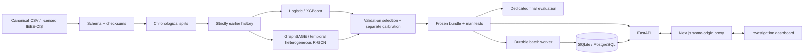

# Architecture

The Python pipeline owns validation, feature generation, training and final evaluation. Artifacts are local versioned files, mountable from an object-store-backed volume; no cloud account is necessary. The bundle contains five fitted models, the training-only scaler, the calibration fit and the provenance manifest. Only trusted operator-produced joblib bundles may be loaded: Python pickle is executable serialization.

The graph model sees transaction features and directed historical relationships. GraphSAGE uses the causal transaction projection and discards relation labels. R-GCN expands each relation into a typed entity snapshot at the destination transaction's cutoff. Its first layer aggregates prior transaction vectors into that snapshot; its second layer passes the snapshot into the scored transaction. No entity state is shared across prediction cutoffs. See [graph schema](docs/graph-schema.md).

The separate `scaling/` research path stores temporal neighbors and fixed feature aggregates in memory-mapped arrays. Exact two-layer batch computation avoids materializing the complete heterogeneous graph and its autograd state. Gradient accumulation retains one full-training-set optimizer update per epoch. Its bundle contains only the two graph candidates and their selected calibrator; cache files hold preprocessing and provenance. This offline format is not a drop-in replacement for the five-model serving bundle shown above. See [scaling](docs/scaling.md) for equivalence checks, limits and reproduction.

The serving queue initially imports scored **validation** transactions so the dashboard cannot silently reveal final test labels or metrics. Subsequent batches use frozen train/validation history plus the events in that batch. Separate batches do not mutate the frozen historical graph. This makes replay reproducible but requires explicit rebuilding for accumulating history.

The API persists alert scores and evidence snapshots, cases, notes, job payloads, and audit records. It does not compute fraud judgments in HTTP handlers. The worker claims a queued job and commits all its alerts with its completion state in one database transaction. A worker crash rolls the claim back. PostgreSQL uses `FOR UPDATE SKIP LOCKED`; SQLite is a single-worker local option. Duplicate submission hashes include actor, model version and input payload. Event IDs are globally unique in a database; collisions fail rather than overwrite evidence.

The browser receives no server-secret environment variable. It supplies an analyst bearer token, which Next forwards only to its configured internal API origin. Every data and mutation endpoint authenticates the caller. Cases, notes, jobs, exports and audit views are owner-scoped; alerts and entity evidence are shared among authenticated analysts. The local token is intentionally public for the synthetic demo. Staging rejects it and requires a long configured token. A public service additionally needs TLS, a real identity provider, credential rotation, request limits and an operational review.

Live-process health is separate from readiness. Readiness requires a reachable database and validated model artifacts. Request logs contain generated request IDs, method, status and elapsed time; raw identifiers and tokens are not logged by application telemetry. Alert-level provenance carries cutoff, model version, input missingness and batch latency.

Failure modes include missing artifacts (not ready), corrupt model/dataset (startup failure), invalid input (422), missing or unauthorized private resources (404), invalid authentication (401), worker validation failure (failed durable job), and API unavailability (visible dashboard error with retry). Database backup, artifact verification, version rollback and evidence retention are operator responsibilities.

Queue filtering, ranking, summaries and pagination execute in SQL, with expression indexes for score, amount and time. Case notes use integer revision checks to reject concurrent overwrites. Entity exploration still scans persisted evidence snapshots; a large deployment needs normalized entity associations and measured workload limits. No claim of internet-facing production readiness is made.
